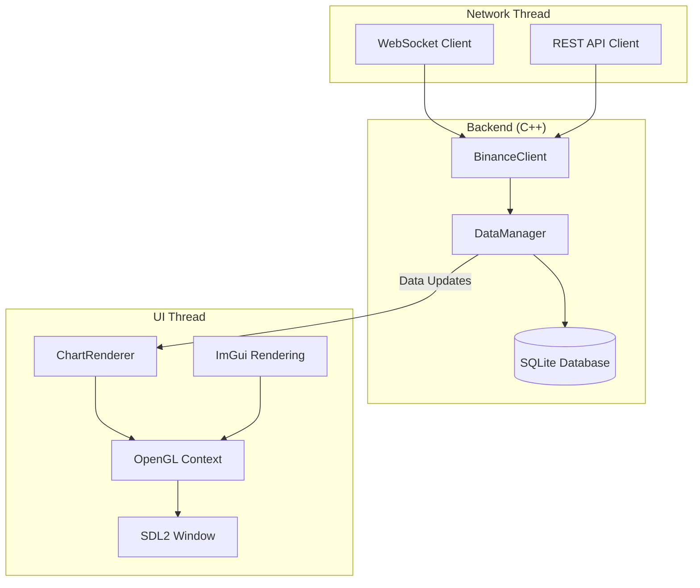
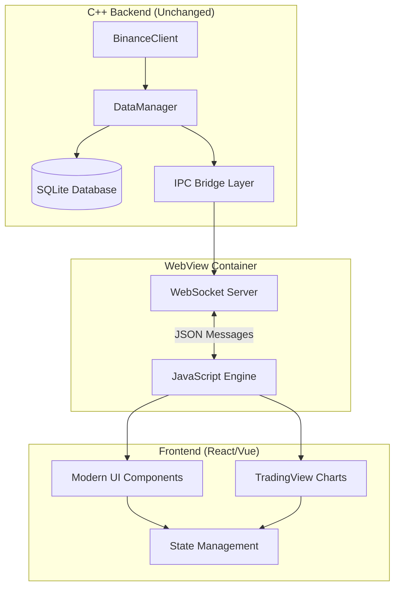
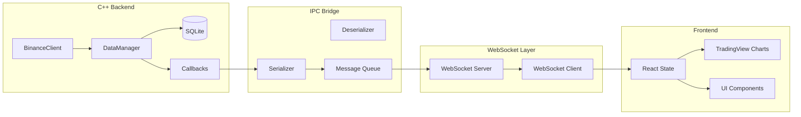
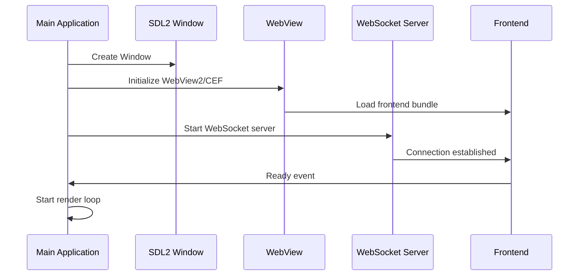
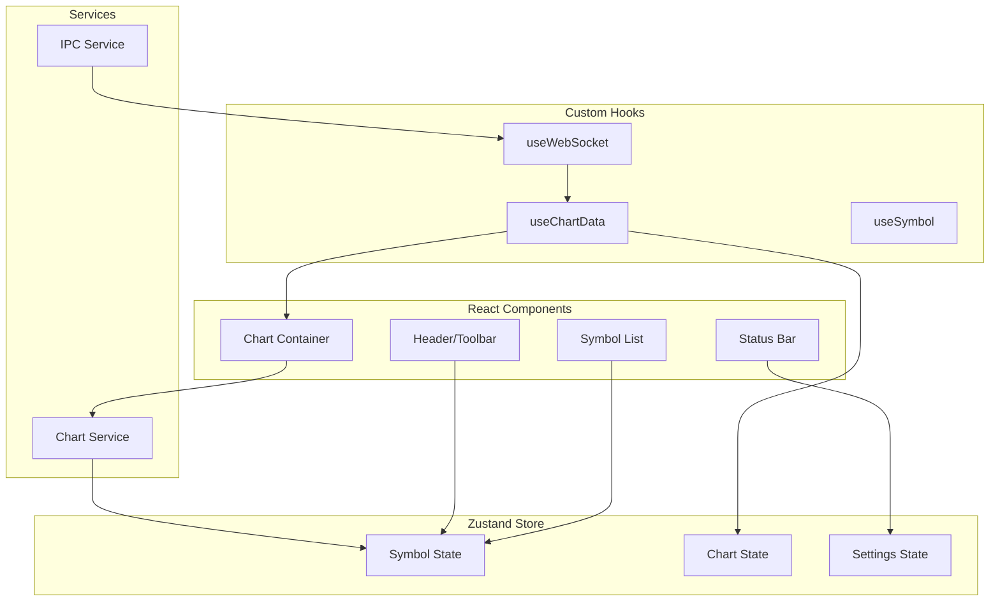
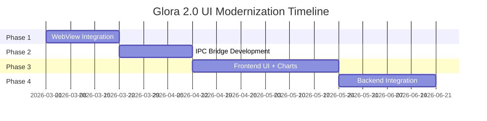

# Technical Specification: Glora 2.0 UI Modernization

**Document Version:** 1.0  
**Date:** 2026-02-23  
**Status:** Draft for Review  
**Classification:** Technical Architecture Document

---

## Table of Contents

1. [Executive Summary](#1-executive-summary)
2. [Architecture Design](#2-architecture-design)
3. [Integration Architecture](#3-integration-architecture)
4. [Component Design](#4-component-design)
5. [Implementation Roadmap](#5-implementation-roadmap)
6. [Risk Assessment](#6-risk-assessment)
7. [Alternative: Enhanced ImGui](#7-alternative-enhanced-imgui)

---

## 1. Executive Summary

### 1.1 Problem Statement

The current Glora 2.0 trading application suffers from a "primitive" user interface that fails to meet modern trading platform standards. The existing UI implementation has the following limitations:

| Issue Category | Current Limitation | Impact |
|----------------|-------------------|--------|
| **Visual Design** | Basic ImDrawList rendering with hardcoded colors | No professional styling, limited theming |
| **Chart Rendering** | No GPU shaders, CPU-bound drawing | Limited performance, basic animations |
| **Components** | Stock ImGui widgets only | No advanced UI controls (dropdowns, trees, rich text) |
| **Responsiveness** | No responsive layout system | Poor multi-monitor/DPI support |
| **User Experience** | Minimal interaction feedback | Steep learning curve for new users |

### 1.2 Proposed Solution Overview

We propose **two architectural approaches** for modernizing the UI:

1. **Primary Approach: WebView + TradingView Lightweight Charts**
   - Embed a modern web-based UI using CEF (Chromium Embedded Framework) or WebView2
   - Leverage TradingView's Lightweight Charts library for professional-grade charting
   - React/Vue.js frontend for responsive, modern UI components

2. **Alternative Approach: Enhanced ImGui with GPU Shaders**
   - Keep existing C++ rendering pipeline
   - Add custom GPU shaders for visual improvements
   - Implement professional ImGui theme and custom components

---

## 2. Architecture Design

### 2.1 Current Architecture Overview



### 2.2 Recommended: WebView/CEF + TradingView Architecture



### 2.3 Technology Stack Comparison

| Component | Current | WebView Approach | Enhanced ImGui |
|-----------|---------|------------------|----------------|
| **Language** | C++17 | C++17 + JavaScript | C++17 |
| **UI Framework** | ImGui | React 18 + TypeScript | ImGui + Custom |
| **Charting** | Custom OpenGL | TradingView Lightweight | Custom OpenGL |
| **Styling** | Hardcoded | CSS/Tailwind | Custom Shaders |
| **Build** | CMake | CMake + Vite | CMake |
| **Dependencies** | Minimal | CEF/WebView2 + Node.js | GLSL + ImGui |

### 2.4 WebView Technology Options

| Technology | Platform Support | License | Complexity | Performance |
|------------|-----------------|---------|------------|-------------|
| **WebView2 (Win)** | Windows 10+ | MIT-like | Low | Excellent |
| **CEF (Chromium)** | All | BSD | High | Good |
| **Ultralight** | All | GPL/commercial | Medium | Good |
| **WebKitGTK** | Linux | LGPL | Medium | Good |
| **Edge WebView2** | Windows | Microsoft EULA | Low | Excellent |

**Recommendation:** Use **WebView2** for Windows with CEF as cross-platform fallback.

---

## 3. Integration Architecture

### 3.1 IPC Bridge Layer Design

The IPC Bridge Layer enables seamless communication between the C++ backend and the web-based frontend.

```mermaid
sequenceDiagram
    participant C++ as C++ Backend
    participant IPC as IPC Bridge
    participant WS as WebSocket Server
    participant FE as Frontend (JS)
    
    Note over C++: Data Update Event
    C++->>IPC: DataManager callback triggered
    IPC->>IPC: Serialize to JSON
    IPC->>WS: Send message
    WS->>FE: dispatchEvent
    FE->>FE: Update React State
    FE->>FE: Re-render Components
    
    Note over FE: User Interaction
    FE->>FE: Handle click/zoom
    FE->>WS: Send request JSON
    WS->>IPC: Receive message
    IPC->>IPC: Parse and route
    IPC->>C++: Call handler function
    C++->>C++: Process request
```

### 3.2 Data Flow: C++ Backend → WebView → React/Vue UI



### 3.3 Message Protocol (JSON over WebSocket)

#### 3.3.1 Message Format

```json
{
  "type": "message_type",
  "payload": { ... },
  "timestamp": 1708700000000,
  "requestId": "uuid-string"
}
```

#### 3.3.2 Message Types

| Direction | Message Type | Description |
|-----------|--------------|-------------|
| **C++ → JS** | `candle_update` | New candle data available |
| **C++ → JS** | `tick_update` | New tick received |
| **C++ → JS** | `gap_filled` | Gap filling completed |
| **C++ → JS** | `connection_status` | WebSocket connection state |
| **JS → C++** | `subscribe_symbol` | Subscribe to symbol data |
| **JS → C++** | `set_timeframe` | Change chart timeframe |
| **JS → C++** | `load_history` | Request historical data |
| **JS → C++** | `get_settings` | Request current settings |

#### 3.3.3 Example Messages

**Candle Update (C++ → JS):**
```json
{
  "type": "candle_update",
  "payload": {
    "symbol": "BTCUSDT",
    "interval": "1m",
    "candle": {
      "time": 1708699200000,
      "open": 42000.50,
      "high": 42100.00,
      "low": 41950.25,
      "close": 42050.75,
      "volume": 125.432
    }
  },
  "timestamp": 1708700000000,
  "requestId": null
}
```

**Subscribe Symbol (JS → C++):**
```json
{
  "type": "subscribe_symbol",
  "payload": {
    "symbol": "BTCUSDT",
    "interval": "5m"
  },
  "timestamp": 1708700000000,
  "requestId": "req-001"
}
```

---

## 4. Component Design

### 4.1 WebView Container Integration

#### 4.1.1 Initialization Sequence



#### 4.1.2 Integration Points

| Component | Responsibility | Interface |
|-----------|---------------|-----------|
| `WebViewContainer` | Manages WebView lifecycle | Initialize, LoadURL, ExecuteJS |
| `WebSocketServer` | IPC message transport | Start, Stop, Send, OnMessage |
| `IPCBridge` | Serialization/routing | RegisterHandler, Send |
| `ChartBridge` | Chart data mapping | ToChartData, FromChartData |

### 4.2 IPC Message Handlers

#### 4.2.1 C++ Handler Registration

```cpp
// ipc_handler.h
#pragma once
#include <functional>
#include <string>
#include <nlohmann/json.hpp>

using json = nlohmann::json;

namespace glora {
namespace ipc {

using MessageHandler = std::function<void(const json&)>;

class IPCHandler {
public:
    void registerHandler(const std::string& type, MessageHandler handler);
    void handleMessage(const json& message);
    void sendMessage(const std::string& type, const json& payload);
    
private:
    std::map<std::string, MessageHandler> handlers_;
    std::string generateRequestId();
};

} // namespace ipc
} // namespace glora
```

#### 4.2.2 Handler Implementation

```cpp
// Register handlers in MainWindow or App
void setupIPCHandlers(IPCHandler& handler, DataManager& dm) {
    handler.registerHandler("subscribe_symbol", [&](const json& msg) {
        std::string symbol = msg["payload"]["symbol"];
        dm.loadSymbolData(symbol);
    });
    
    handler.registerHandler("set_timeframe", [&](const json& msg) {
        std::string interval = msg["payload"]["interval"];
        // Update timeframe logic
    });
    
    handler.registerHandler("get_settings", [&](const json& msg) {
        json settings = loadSettings();
        handler.sendMessage("settings_response", settings);
    });
}
```

### 4.3 Chart Data Serialization

#### 4.3.1 Candle Data to TradingView Format

```cpp
// chart_bridge.h
#pragma once
#include "../../core/DataModels.h"
#include <nlohmann/json.hpp>

namespace glora {
namespace bridge {

using json = nlohmann::json;

struct TradingViewCandle {
    int64_t time;       // Unix timestamp (seconds)
    double open;
    double high;
    double low;
    double close;
    double volume;
};

TradingViewCandle toTradingView(const core::Candle& candle) {
    return {
        .time = candle.start_time_ms / 1000,
        .open = candle.open,
        .high = candle.high,
        .low = candle.low,
        .close = candle.close,
        .volume = candle.volume
    };
}

json serializeCandles(const std::vector<core::Candle>& candles) {
    json result = json::array();
    for (const auto& candle : candles) {
        result.push_back(toTradingView(candle));
    }
    return result;
}

} // namespace bridge
} // namespace glora
```

### 4.4 Frontend Framework Selection

#### 4.4.1 React vs Vue Comparison

| Aspect | React 18 | Vue 3 |
|--------|----------|-------|
| **Learning Curve** | Moderate | Low |
| **TypeScript Support** | Excellent | Excellent |
| **Ecosystem** | Larger | Growing |
| **Performance** | Excellent | Excellent |
| **Charting Libraries** | Rich | Good |
| **State Management** | Redux/Zustand | Pinia |
| **Team Preference** | Most common | Easier for C++ devs |

#### 4.4.2 Recommended Stack

- **Framework:** React 18 with TypeScript
- **Build Tool:** Vite
- **State Management:** Zustand (lightweight)
- **Charting:** TradingView Lightweight Charts
- **Styling:** Tailwind CSS
- **HTTP Client:** Native fetch + React Query

### 4.5 Frontend Architecture



---

## 5. Implementation Roadmap

### 5.1 Phase 1: WebView Integration

**Duration:** 2-3 weeks  
**Objective:** Establish WebView container and basic communication layer

| Task | Description | Dependencies |
|------|-------------|--------------|
| 1.1 | Integrate WebView2 (Windows) library via CMake | CMake setup |
| 1.2 | Create WebViewContainer class | None |
| 1.3 | Implement WebSocket server in C++ | None |
| 1.4 | Create frontend project with Vite | Node.js |
| 1.5 | Build and load basic HTML in WebView | 1.1, 1.3 |
| 1.6 | Establish WebSocket connection | 1.3, 1.5 |

### 5.2 Phase 2: IPC Bridge Development

**Duration:** 2-3 weeks  
**Objective:** Enable bidirectional communication between C++ and frontend

| Task | Description | Dependencies |
|------|-------------|--------------|
| 2.1 | Design and implement JSON message protocol | Phase 1 |
| 2.2 | Create IPC message handler system | 2.1 |
| 2.3 | Implement DataManager → Frontend data flow | 2.2 |
| 2.4 | Implement Frontend → C++ command handlers | 2.2 |
| 2.5 | Add message queuing for reliability | 2.2 |
| 2.6 | Error handling and reconnection logic | 2.5 |

### 5.3 Phase 3: Frontend UI with TradingView Charts

**Duration:** 4-6 weeks  
**Objective:** Build professional trading UI with TradingView charts

| Task | Description | Dependencies |
|------|-------------|--------------|
| 3.1 | Set up React + TypeScript + Vite project | Phase 1 |
| 3.2 | Integrate TradingView Lightweight Charts | 3.1 |
| 3.3 | Implement chart data bridge (C++ → Chart) | Phase 2 |
| 3.4 | Build symbol selector and toolbar | 3.1 |
| 3.5 | Create price scale and time scale components | 3.2 |
| 3.6 | Implement crosshair and tooltip interactions | 3.2 |
| 3.7 | Add volume sub-chart | 3.2 |
| 3.8 | Style UI with Tailwind CSS | 3.1 |

### 5.4 Phase 4: Connect to Existing C++ Backend

**Duration:** 3-4 weeks  
**Objective:** Full integration with existing DataManager, BinanceClient, SQLite

| Task | Description | Dependencies |
|------|-------------|--------------|
| 4.1 | Connect IPC handlers to DataManager | Phase 2 |
| 4.2 | Wire up BinanceClient for live data | Existing code |
| 4.3 | Integrate with SQLite for history | Existing code |
| 4.4 | Implement gap detection UI feedback | 4.1 |
| 4.5 | Add settings panel (API keys, etc.) | 4.1 |
| 4.6 | Performance testing and optimization | All |

### 5.5 Implementation Timeline Summary



---

## 6. Risk Assessment

### 6.1 Browser Compatibility

| Risk | Severity | Likelihood | Mitigation |
|------|----------|------------|------------|
| WebView2 not installed on Win7 | Medium | Low | Bundle WebView2 installer |
| CEF memory usage too high | High | Medium | Use minimal CEF config |
| WebView on Linux not stable | High | Medium | Fallback to enhanced ImGui |
| JavaScript engine crash | Medium | Low | Isolated iframe rendering |

### 6.2 Performance Considerations

| Risk | Severity | Likelihood | Mitigation |
|------|----------|------------|------------|
| JSON serialization bottleneck | Medium | Medium | Binary protocol if needed |
| WebView rendering lag | Medium | Low | Hardware acceleration |
| Memory leak in CEF | High | Medium | Regular GC, monitoring |
| Data transfer latency | Low | Low | WebSocket binary frames |

### 6.3 Maintenance Overhead

| Risk | Severity | Likelihood | Mitigation |
|------|----------|------------|------------|
| Frontend dependencies outdated | Medium | High | Use LTS versions |
| CEF version drift | Medium | Medium | Fixed version in CMake |
| Dual codebase maintenance | High | High | Clear abstraction layer |
| Skill gap (C++ vs JS) | Medium | Medium | Documentation, training |

### 6.4 Risk Mitigation Summary

| Priority | Action Item |
|----------|-------------|
| **Critical** | Establish fallback to enhanced ImGui if WebView fails |
| **Critical** | Implement proper memory management and monitoring |
| **High** | Create comprehensive IPC protocol documentation |
| **High** | Set up automated testing for frontend and IPC bridge |
| **Medium** | Use WebView2 for Windows (most stable) |
| **Medium** | Keep frontend dependencies on known LTS versions |

---

## 7. Alternative: Enhanced ImGui

### 7.1 Quick Wins with Minimal Effort

For teams that prefer to stay within the C++ ecosystem, here are quick improvements:

#### 7.1.1 Professional Theme Implementation

```cpp
// Custom ImGui theme - "Trading Dark"
void applyTradingTheme() {
    ImGuiStyle& style = ImGui::GetStyle();
    
    // Colors
    style.Colors[ImGuiCol_WindowBg] = ImVec4(0.08f, 0.08f, 0.10f, 1.00f);
    style.Colors[ImGuiCol_ChildBg] = ImVec4(0.05f, 0.05f, 0.07f, 1.00f);
    style.Colors[ImGuiCol_Text] = ImVec4(0.90f, 0.90f, 0.90f, 1.00f);
    style.Colors[ImGuiCol_Border] = ImVec4(0.20f, 0.20f, 0.25f, 1.00f);
    style.Colors[ImGuiCol_Button] = ImVec4(0.15f, 0.35f, 0.65f, 1.00f);
    style.Colors[ImGuiCol_ButtonHovered] = ImVec4(0.20f, 0.45f, 0.75f, 1.00f);
    style.Colors[ImGuiCol_ButtonActive] = ImVec4(0.10f, 0.25f, 0.55f, 1.00f);
    
    // Rounding
    style.FrameRounding = 4.0f;
    style.WindowRounding = 6.0f;
    style.ChildRounding = 4.0f;
    
    // Spacing
    style.ItemSpacing = ImVec2(8, 6);
    style.ItemInnerSpacing = ImVec2(6, 4);
    style.IndentSpacing = 20;
}
```

#### 7.1.2 GPU Shader Improvements

**Vertex Shader (Grid):**
```glsl
#version 330 core
layout(location = 0) in vec2 aPosition;
layout(location = 1) in vec3 aColor;

uniform mat4 uProjection;
uniform mat4 uView;

out vec3 vColor;

void main() {
    gl_Position = uProjection * uView * vec4(aPosition, 0.0, 1.0);
    vColor = aColor;
}
```

**Fragment Shader (Glow Effect):**
```glsl
#version 330 core
in vec3 vColor;
out vec4 FragColor;

uniform float uGlowIntensity;
uniform vec2 uGlowCenter;

void main() {
    float dist = length(vColor - uGlowCenter);
    float glow = exp(-dist * 2.0) * uGlowIntensity;
    FragColor = vec4(vColor + glow, 1.0);
}
```

#### 7.1.3 Custom ImGui Components

| Component | Description | Implementation |
|-----------|-------------|----------------|
| `ImGui::SymbolPicker` | Dropdown with search for trading pairs | Custom widget |
| `ImGui::TimeframeSelector` | Button group (1m, 5m, 15m, etc.) | Custom widget |
| `ImGui::PriceDisplay` | Formatted price with color | Custom widget |
| `ImGui::VolumeBar` | Gradient-filled volume bar | Custom widget |
| `ImGui::OrderBook` | Bid/Ask depth display | Custom widget |

### 7.2 Enhanced ImGui Implementation Effort

| Enhancement | Effort | Impact | Recommendation |
|-------------|--------|--------|----------------|
| Custom theme | 1 day | High | **Do first** |
| GPU grid shader | 2 days | Medium | Optional |
| Custom widgets | 3-5 days | High | **Do first** |
| Advanced charts | 2-3 weeks | High | Consider WebView |
| Animation system | 1 week | Medium | Optional |

### 7.3 Comparison Summary

| Factor | WebView + TradingView | Enhanced ImGui |
|--------|----------------------|----------------|
| **Development Time** | 8-12 weeks | 3-5 weeks |
| **Chart Quality** | Professional (TradingView) | Custom (requires work) |
| **UI Flexibility** | High (CSS/React) | Limited (ImGui) |
| **Maintenance** | Two codebases | Single C++ codebase |
| **Performance** | Good (hardware accel) | Good (native) |
| **Learning Curve** | C++ + JavaScript | C++ only |

---

## 8. Recommendations and Conclusion

### 8.1 Primary Recommendation

**For a professional trading platform with minimal development effort, we recommend the WebView + TradingView approach.**

Rationale:
1. TradingView charts are industry-standard and provide professional features out-of-the-box
2. React/Vue ecosystem offers rich UI component libraries
3. Modern UI attracts users and improves engagement
4. WebView2 on Windows provides excellent performance and stability

### 8.2 Decision Matrix

| Criteria | Weight | WebView | Enhanced ImGui |
|----------|--------|---------|----------------|
| Time to Market | 25% | 6 | 8 |
| Chart Quality | 25% | 9 | 5 |
| UI Modernization | 20% | 9 | 4 |
| Maintenance | 15% | 5 | 8 |
| Performance | 15% | 8 | 8 |
| **Weighted Score** | 100% | **7.4** | **6.5** |

### 8.3 Next Steps

1. **Review this specification** with stakeholders
2. **Prototype:** Create minimal WebView integration to validate feasibility
3. **Decision:** Confirm approach based on prototype results
4. **Planning:** Detailed sprint planning for selected approach

---

## Appendix A: File Structure

```
glora2.0-1/
├── plan/
│   └── tech_spec_ui_modernization.md  ← This document
├── src/
│   ├── main.cpp
│   ├── core/
│   │   ├── DataManager.cpp/h
│   │   ├── DataModels.h
│   │   └── ChartDataManager.h
│   ├── database/
│   │   └── Database.cpp/h
│   ├── network/
│   │   └── BinanceClient.cpp/h
│   ├── render/
│   │   ├── MainWindow.cpp/h
│   │   └── ChartRenderer.cpp/h
│   ├── ipc/                    ← New
│   │   ├── IPCHandler.cpp/h
│   │   ├── WebSocketServer.cpp/h
│   │   └── MessageProtocol.h
│   └── webview/                ← New
│       └── WebViewContainer.cpp/h
├── frontend/                   ← New
│   ├── src/
│   │   ├── components/
│   │   ├── hooks/
│   │   ├── services/
│   │   └── stores/
│   ├── package.json
│   └── vite.config.ts
└── CMakeLists.txt
```

---

## Appendix B: References

- [TradingView Lightweight Charts](https://tradingview.github.io/lightweight-charts/)
- [WebView2 Documentation](https://learn.microsoft.com/en-us/microsoft-edge/webview2/)
- [CEF (Chromium Embedded Framework)](https://bitbucket.org/chromiumembedded/cef)
- [React 18 Documentation](https://react.dev/)
- [ImGui Theme Editor](https://github.com/ocornut/imgui/blob/master/misc/fonts/imgui_theme_editor.py)

---

*End of Technical Specification*
