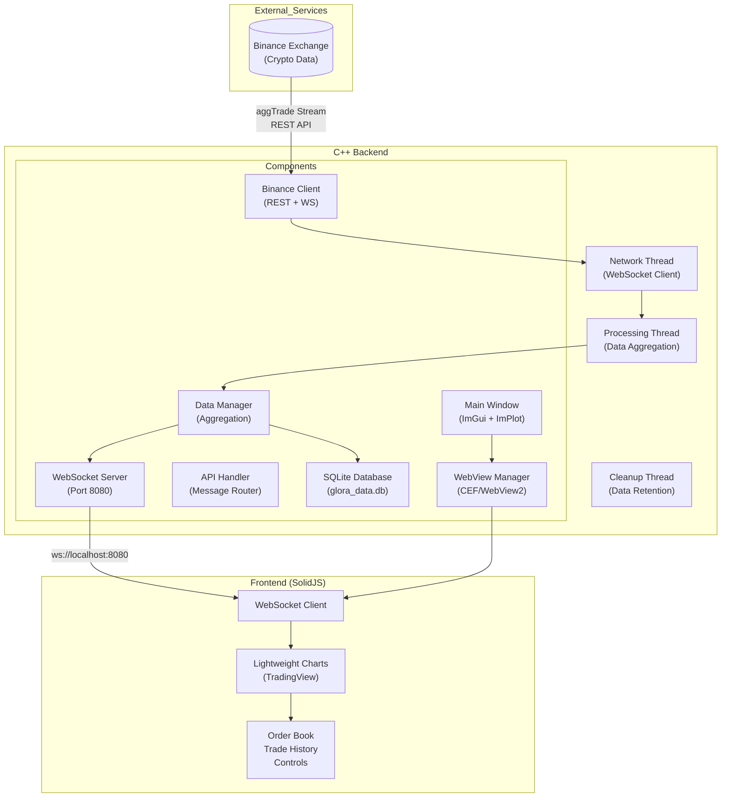
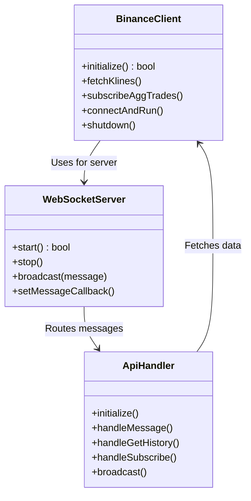
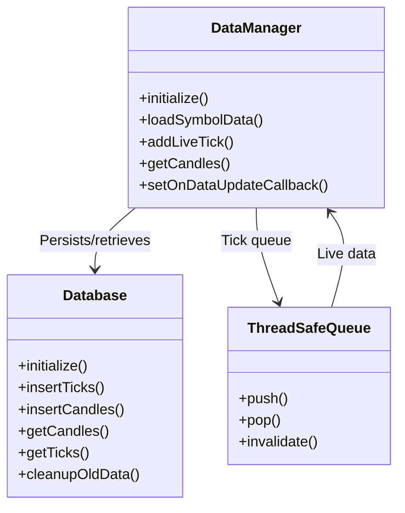
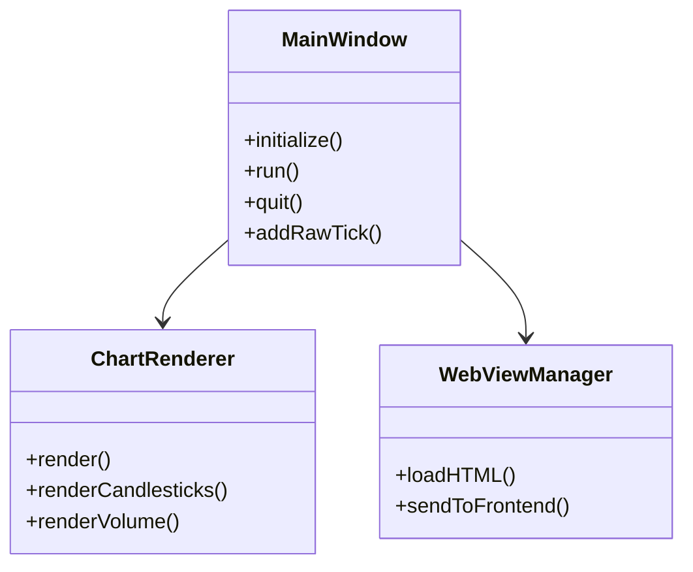
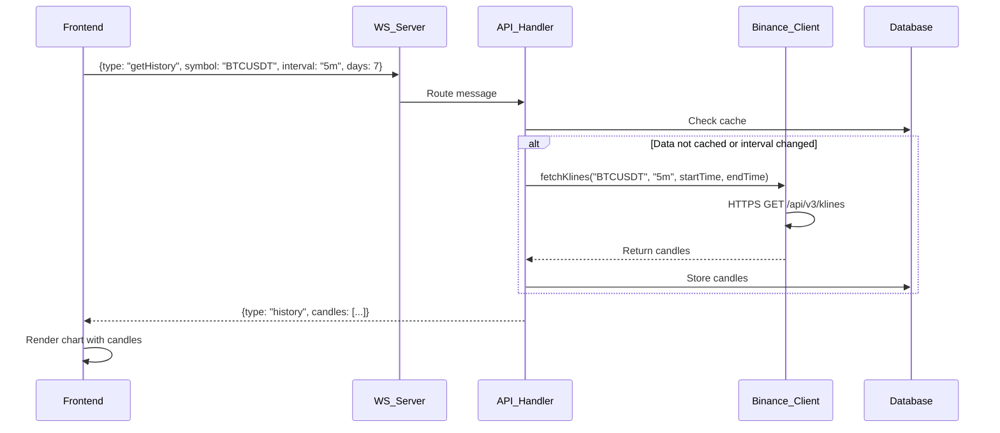
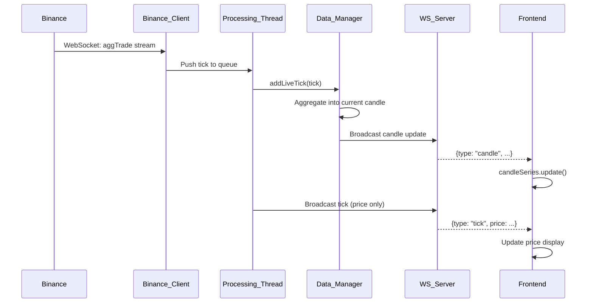
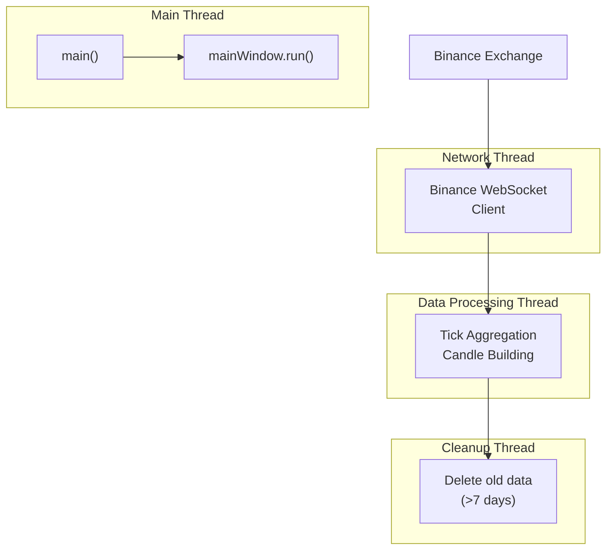
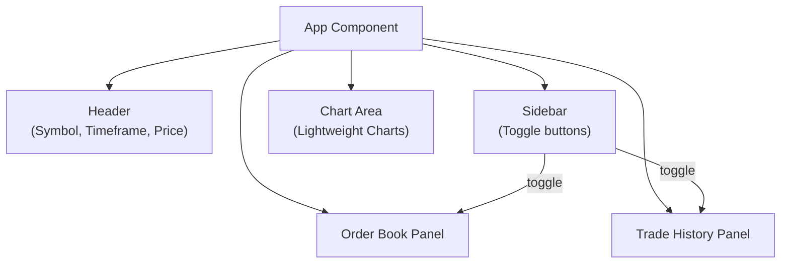
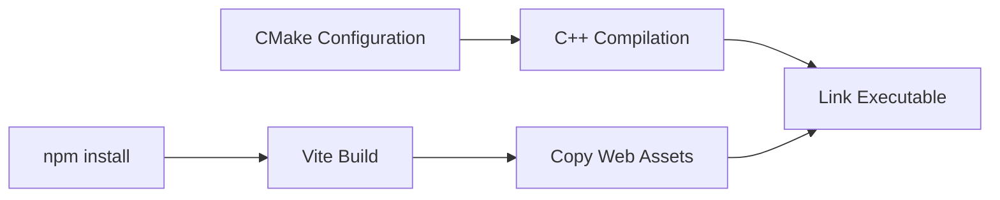

# Glora 2.0 System Architecture Report

## Executive Summary

Glora 2.0 is a real-time cryptocurrency trading chart application that provides live market data visualization with historical data analysis. The system uses a hybrid architecture combining a high-performance C++ backend with a modern reactive JavaScript frontend.

---

## 1. System Architecture Overview

### High-Level Architecture Diagram



---

## 2. Technology Stack

### Backend Technologies

| Component | Technology | Version | Purpose |
|----------|------------|---------|---------|
| Language | C++ | C++20 | Core application logic |
| Build System | CMake | 3.16+ | Cross-platform build management |
| GUI Framework | Dear ImGui | 1.92.6 | Desktop UI rendering |
| Charting (Desktop) | ImPlot | 0.17 | High-performance chart rendering |
| WebView | CEF / WebView2 | Latest | Embedded browser for frontend |
| JSON Parsing | nlohmann/json | 3.12.0 | JSON serialization/deserialization |
| WebSocket/HTTP | IXWebSocket | 11.4.6 | Network communication |
| Database | SQLite3 | 3.x | Local data persistence |
| Graphics | OpenGL | 3.x | Hardware-accelerated rendering |
| Windowing | SDL2 | 2.x | Cross-platform window management |
| TLS | OpenSSL | 3.x | Secure HTTPS connections |

### Frontend Technologies

| Component | Technology | Version | Purpose |
|----------|------------|---------|---------|
| Framework | SolidJS | 1.8.0 | Reactive UI framework |
| Build Tool | Vite | 5.0.0 | Fast development & bundling |
| Charts | Lightweight Charts | 4.1.0 | TradingView chart library |
| Language | JavaScript/JSX | ESNext | Frontend logic |

---

## 3. Component Architecture

### 3.1 Network Layer



**Key Responsibilities:**

- **BinanceClient**: Connects to Binance API for historical data (REST) and real-time streams (WebSocket)
- **WebSocketServer**: Serves frontend clients on port 8080, handles bidirectional communication
- **ApiHandler**: Routes incoming messages, manages subscriptions, coordinates data flow

### 3.2 Data Layer



**Data Models:**

```
Tick:
  - timestamp_ms: uint64_t    // Millisecond timestamp
  - price: double             // Execution price
  - quantity: double          // Trade size
  - is_buyer_maker: bool      // Trade direction

Candle:
  - start_time_ms: uint64_t  // Candle open time
  - end_time_ms: uint64_t    // Candle close time
  - open/high/low/close: double  // OHLC prices
  - volume: double            // Total volume
  - footprint_profile: map    // Bid/Ask volume at price levels
```

### 3.3 Rendering Layer



**Dual Rendering Approach:**

1. **Desktop UI (ImGui + ImPlot)**: Native C++ rendering with ImPlot charts
2. **WebView (SolidJS)**: Embedded browser with TradingView Lightweight Charts

---

## 4. Data Flow Architecture

### 4.1 Historical Data Flow



### 4.2 Real-Time Data Flow



---

## 5. Threading Model



**Thread Responsibilities:**

| Thread | Function |
|--------|----------|
| Main Thread | Application entry, UI rendering, event loop |
| Network Thread | Binance WebSocket connection, data ingestion |
| Processing Thread | Tick aggregation, candle building, queue consumption |
| Cleanup Thread | Hourly database maintenance (delete data > 7 days) |

---

## 6. Frontend Architecture

### SolidJS Application Structure

```
web/src/
├── App.jsx              # Main application component
├── index.jsx            # Entry point
├── components/
│   └── (built-in)       # Inline components
├── utils/
│   └── backendClient.js # WebSocket client wrapper
└── workers/
    └── chartWorker.js   # (optional) Web Worker for charts
```

### Component Hierarchy



---

## 7. API Protocol

### WebSocket Message Types

#### Frontend → Backend

| Type | Fields | Description |
|------|-------|-------------|
| `getHistory` | symbol, interval, days | Request historical candles |
| `subscribe` | symbol | Subscribe to real-time updates |
| `unsubscribe` | - | Stop receiving updates |
| `setConfig` | days | Configure data retention |

#### Backend → Frontend

| Type | Fields | Description |
|------|-------|-------------|
| `history` | candles[], interval | Historical OHLCV data |
| `candle` | time, open, high, low, close, volume | Real-time candle update |
| `tick` | time, price, quantity | Real-time price tick |
| `subscribed` | symbol | Subscription confirmation |
| `error` | error | Error message |

---

## 8. Database Schema

```sql
-- Ticks table (raw trade data)
CREATE TABLE ticks (
    id INTEGER PRIMARY KEY AUTOINCREMENT,
    symbol TEXT NOT NULL,
    timestamp_ms INTEGER NOT NULL,
    price REAL NOT NULL,
    quantity REAL NOT NULL,
    is_buyer_maker INTEGER NOT NULL,
    UNIQUE(symbol, timestamp_ms, price, quantity)
);

-- Candles table (aggregated OHLCV)
CREATE TABLE candles (
    id INTEGER PRIMARY KEY AUTOINCREMENT,
    symbol TEXT NOT NULL,
    start_time_ms INTEGER NOT NULL,
    end_time_ms INTEGER NOT NULL,
    open REAL NOT NULL,
    high REAL NOT NULL,
    low REAL NOT NULL,
    close REAL NOT NULL,
    volume REAL NOT NULL,
    UNIQUE(symbol, start_time_ms)
);

-- Indexes for fast queries
CREATE INDEX idx_ticks_symbol_time ON ticks(symbol, timestamp_ms);
CREATE INDEX idx_candles_symbol_time ON candles(symbol, start_time_ms);
```

---

## 9. Build & Deployment

### Build Process



### Build Command

```bash
mkdir build && cd build
cmake ..
make -j4
```

Output: `./build/GloraChart`

---

## 10. Key Features

| Feature | Implementation |
|---------|---------------|
| Real-time Charts | WebSocket streaming + Lightweight Charts |
| Multiple Timeframes | 1m, 5m, 15m, 1h, 4h, 1D |
| Historical Data | REST API caching with SQLite |
| Order Book | Static demo (real implementation pending) |
| Trade History | Static demo (real implementation pending) |
| Cross-platform | Windows (WebView2), Linux/macOS (CEF) |
| Desktop UI | ImGui + ImPlot native charts |

---

## 11. Architecture Decisions

### Why This Design?

1. **C++ Backend**: High-performance data processing for real-time streaming
2. **SolidJS**: Fine-grained reactivity without virtual DOM overhead
3. **Lightweight Charts**: GPU-accelerated rendering, designed for financial data
4. **SQLite**: Simple, embedded, zero-configuration persistence
5. **WebView Hybrid**: Combine native performance with web UI flexibility
6. **Threading**: Separate network/processing from UI for responsiveness

### Trade-offs

- **Complexity**: Dual rendering (native + WebView) increases maintenance
- **Database**: SQLite not ideal for high-frequency writes (consider RocksDB)
- **State Management**: Frontend state could benefit from more robust solution

---

## 12. Future Improvements

1. **Performance**: Use FlatBuffers instead of JSON for serialization
2. **Database**: Replace SQLite with RocksDB for better write throughput
3. **Web Workers**: Move chart updates to Web Worker for 60fps rendering
4. **Real Data**: Implement live Order Book and Trade History from Binance
5. **Authentication**: Secure API key storage with encryption
6. **Multi-symbol**: Support multiple trading pairs simultaneously
