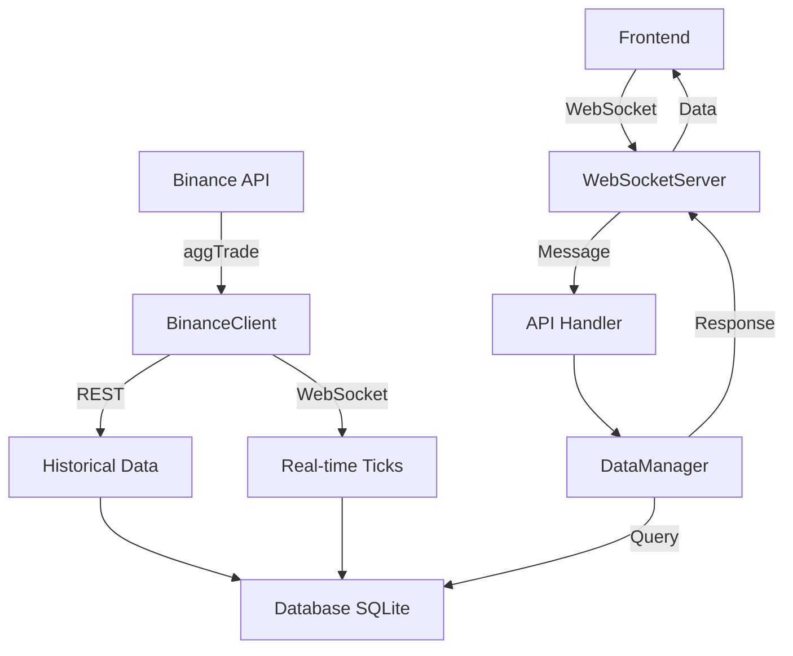

# Implementation Plan: Backend API & Data Storage Enhancement

## Current Status Analysis

### ✓ Already Implemented
| Component | Features |
|-----------|----------|
| **BinanceClient** | aggTrade REST fetching, WebSocket subscription, proper is_buyer_maker handling |
| **Database** | SQLite with WAL mode, ticks/candles tables, gap detection |
| **DataManager** | Gap filling, 7-day history config, footprint (bid/ask volume) calculation |
| **WebSocketServer** | Basic message broadcasting to frontend |
| **Frontend IPC** | useIPC hooks, message protocol defined |

### ✗ Gaps Identified
1. **No message handler**: WebSocketServer doesn't route incoming frontend requests
2. **No DB initialization**: main.cpp doesn't initialize Database
3. **No API integration**: DataManager not connected to WebSocketServer
4. **Limited API endpoints**: Frontend cannot request specific time ranges or configure 5-7 days

---

## Implementation Tasks

### Phase 1: C++ Backend Enhancement

#### 1.1 Create API Message Handler
```cpp
// src/network/ApiHandler.h
// Handles incoming messages from frontend via WebSocket
// Message types:
// - "getHistory": Fetch historical candles (with startTime, endTime, days parameter)
// - "getFootprint": Get footprint data for specific candle
// - "subscribe": Subscribe to real-time updates
// - "setConfig": Configure data fetch parameters (days: 5-7)
```

#### 1.2 Integrate Components in main.cpp
- Initialize Database
- Initialize DataManager with settings
- Connect DataManager to WebSocketServer
- Wire message handler for API requests

#### 1.3 Enhance DataManager API
- Add method to get candles with custom time range
- Add method to get footprint data
- Add configurable history duration (5-7 days)

### Phase 2: Frontend Enhancement

#### 2.1 Extend useIPC API
```javascript
// New message types for frontend
// - requestHistory(days: 5-7): Request 5-7 days of data
// - requestFootprint(candleTime): Get footprint for specific candle
// - requestRange(startTime, endTime): Custom time range
```

#### 2.2 Update useMarketData Hook
- Support configurable history duration
- Add footprint data fetching

---

## Data Flow Diagram



---

## API Message Protocol

### Frontend → Backend
```json
{
  "type": "getHistory",
  "symbol": "BTCUSDT",
  "days": 7,
  "interval": "1m"
}
```

```json
{
  "type": "getHistory",
  "symbol": "BTCUSDT", 
  "startTime": 1700000000000,
  "endTime": 1700600000000
}
```

```json
{
  "type": "getFootprint",
  "symbol": "BTCUSDT",
  "candleTime": 1700500000000
}
```

### Backend → Frontend
```json
{
  "type": "history",
  "symbol": "BTCUSDT",
  "candles": [
    {
      "time": 1700500000000,
      "open": 42000,
      "high": 42100,
      "low": 41900,
      "close": 42050,
      "volume": 100.5,
      "footprint": {
        "42000": {"bid": 10.5, "ask": 5.2},
        "42050": {"bid": 3.1, "ask": 8.7}
      }
    }
  ]
}
```

---

## SQLite Schema (Already Implemented)

```sql
-- Ticks table (aggregate trades)
CREATE TABLE ticks (
  id INTEGER PRIMARY KEY AUTOINCREMENT,
  symbol TEXT NOT NULL,
  timestamp_ms INTEGER NOT NULL,
  price REAL NOT NULL,
  quantity REAL NOT NULL,
  is_buyer_maker INTEGER NOT NULL,
  UNIQUE(symbol, timestamp_ms, price, quantity)
);

-- Candles table
CREATE TABLE candles (
  id INTEGER PRIMARY KEY AUTOINCREMENT,
  symbol TEXT NOT NULL,
  start_time_ms INTEGER NOT NULL,
  end_time_ms INTEGER NOT NULL,
  open REAL NOT NULL,
  high REAL NOT NULL,
  low REAL NOT NULL,
  close REAL NOT NULL,
  volume REAL NOT NULL,
  UNIQUE(symbol, start_time_ms)
);
```

---

## Next Steps

1. **Confirm plan** - User approval needed
2. **Implement API Handler** - Create message routing
3. **Update main.cpp** - Wire all components
4. **Enhance DataManager** - Add API methods
5. **Update Frontend IPC** - New message types

---

## Performance Considerations

- Database uses WAL mode for concurrent read/write
- Bulk insert for historical data
- Cached candles in memory (last 10,000)
- Footprint calculated on-the-fly from ticks
